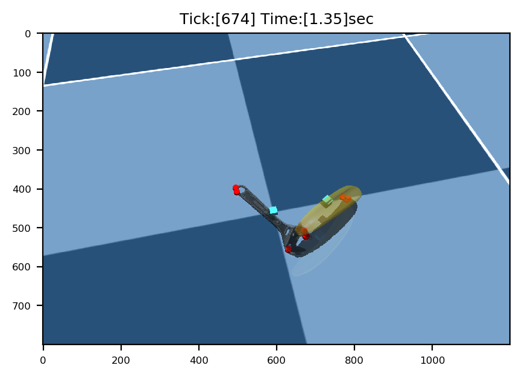

# mujoco-ycb-dataset
Tools to download models from the [YCB dataset](https://www.ycbbenchmarks.com/) and use them with the MuJoCo simulator.



## Python Setup

You only need to install mujoco Python packages to get these tools running.

```
pip install mujoco
```

## Downloading YCB objects

You can download the models using a variant of the download script provided on the [http://ycb-benchmarks.s3-website-us-east-1.amazonaws.com/]. However, this script has been modified to work with Python 3.

```
python ycb_downloader.py
```

You can configure a few options in the script, including choosing which objects and model types to download. However, the default options will get all of the YCB object models and may take a few minutes to download.

## Using YCB Object Models in MuJoCo

After you have downloaded the YCB models, you can run the following jupyer-notebook files.

1. [Convert YCB datasets to MJCF format](https://github.com/joonhyung-lee/mujoco-ycb-dataset/blob/main/dataset_merge.ipynb)
2. [Parsing YCB datasets on MuJoCo scene](https://github.com/joonhyung-lee/mujoco-ycb-dataset/blob/main/parsing_ycb_dataset.ipynb)

**NOTE:** A few of the models in the dataset do not have either of the `google_16k` or `tsdf` meshes available, so these will not work with MuJoCo. So the `dataset_merge.ipynb` will help you.